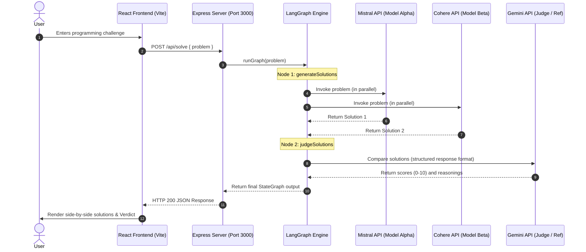

# ⚔️ AI Battle Arena

AI Battle Arena is an interactive, side-by-side LLM coding evaluation platform. It pits two powerhouses—**Mistral AI (Model Alpha)** and **Cohere (Model Beta)**—against each other in real-time coding duels, while utilizing **Google Gemini** as the expert judge to grade correctness, style, completeness, and clarity.

The application leverages a stateful multi-agent workflow powered by **LangGraph** in the backend, and presents an ultra-premium, dark-themed responsive UI in the frontend built with **React 19** and **Tailwind CSS v4**.

---

## 🚀 Key Features

*   **Side-by-Side Dual Code Generation**: Prompts are executed in parallel by Mistral and Cohere.
*   **Structured AI Referencing**: Google Gemini acts as an expert judge, providing an objective score out of 10 and granular evaluation reasoning for both models.
*   **Interactive Battle History**: Persistent chat sessions stored via browser `localStorage` with distinct winner tags (`Winner: Alpha`, `Winner: Beta`, `Tie`).
*   **Syntax Highlighting & Code Copying**: Render code solutions beautifully with an integrated markdown parser and copy-to-clipboard functionality.
*   **Live Backend Connection Monitor**: Real-time heartbeat checking of the server connection status (visualized by a glowing green/red indicator).
*   **Aesthetic Responsive Design**: A high-fidelity, futuristic dark interface featuring modern glassmorphism panels, typography, and glowing gradients.

---

## 📐 Architecture & Flow

### System Interaction Diagram



### LangGraph Workflow

The backend uses a LangGraph `StateGraph` to manage the processing pipeline:

```
[START] ──> [generateSolutions] ──> [judgeSolutions] ──> [END]
```

1.  **State Schema**:
    *   `problem`: The input prompt/coding question.
    *   `solution_1`: Response text from Mistral AI.
    *   `solution_2`: Response text from Cohere.
    *   `judge`: Structured JSON containing:
        *   `solution_1_score` (0-10) & `solution_1_reasoning`
        *   `solution_2_score` (0-10) & `solution_2_reasoning`
2.  **generateSolutions Node**: Executes calls to `Mistral AI` (`mistral-medium-latest`) and `Cohere` (`command-a-03-2025`) simultaneously using `Promise.all()`, updates the state.
3.  **judgeSolutions Node**: Employs a structured LLM output agent powered by `Google Gemini` (`gemini-flash-latest`). It validates the verdict schema through a custom Zod validator to ensure strict JSON formatting.

---

## 🛠️ Technology Stack

### Backend
*   **Runtime**: Node.js
*   **Language**: TypeScript (using `tsconfig.json` and compiled on-the-fly via `tsx`)
*   **Web Framework**: Express
*   **Orchestration**: `@langchain/langgraph` & `langchain`
*   **Model Adapters**: `@langchain/google`, `@langchain/mistralai`, `@langchain/cohere`
*   **Validation**: `zod`
*   **Configuration**: `dotenv`

### Frontend
*   **Framework**: React 19 (Vite)
*   **Styling**: Tailwind CSS v4 (incorporating custom themes and custom CSS utility classes)
*   **Icons**: Google Material Symbols
*   **Storage**: Browser LocalStorage for persistence

---

## 📦 Project Structure

```
AIBettleArena/
├── Backend/
│   ├── src/
│   │   ├── ai/
│   │   │   ├── graph.ai.ts      # LangGraph state schema, solution & judge nodes
│   │   │   └── model.ai.ts      # LLM clients configurations (Gemini, Mistral, Cohere)
│   │   ├── config/
│   │   │   └── config.ts        # Environment configurations loader
│   │   └── app.ts               # Express middleware, CORS setup & route handlers
│   ├── server.ts                # App entry point (listens on port 3000)
│   ├── .env.example             # Template for API keys
│   ├── tsconfig.json            # TypeScript configuration
│   └── package.json             # Backend dependencies & scripts
│
└── Frontend/
    ├── src/
    │   ├── app/
    │   │   ├── App.css          # Core layout CSS
    │   │   └── App.jsx          # Main React view, UI logic & API hooks
    │   ├── index.css            # Tailwind CSS directives & root theme config
    │   └── main.jsx             # React DOM entry point
    ├── index.html               # Main HTML shell
    ├── vite.config.js           # Vite server configuration
    └── package.json             # Frontend dependencies & scripts
```

---

## 🔧 Installation & Setup

Follow these steps to run the AI Battle Arena locally:

### Prerequisites
*   Node.js (v18 or higher recommended)
*   npm or yarn
*   API keys for:
    *   **Google AI Studio** (for Gemini)
    *   **Mistral AI Console**
    *   **Cohere Dashboard**

### 1. Clone & Install Backend

Open your terminal, navigate to the `Backend` directory, and install the dependencies:

```bash
cd Backend
npm install
```

### 2. Configure Environment Variables

Create a `.env` file inside the `Backend` folder. You can copy the example file:

```bash
cp .env.example .env
```

Open `.env` and fill in your API credentials:

```env
GOOGLE_API_KEY=your_gemini_api_key_here
MISTRAL_API_KEY=your_mistral_api_key_here
COHERE_API_KEY=your_cohere_api_key_here
```

### 3. Run the Backend Server

Start the development server. It will monitor for changes using `tsx watch`:

```bash
npm run dev
```
The server will run on `http://localhost:3000`.

### 4. Clone & Install Frontend

Open a new terminal tab, navigate to the `Frontend` directory, and install dependencies:

```bash
cd Frontend
npm install
```

### 5. Run the Frontend Development Server

Launch the Vite development server:

```bash
npm run dev
```
By default, the frontend is served on `http://localhost:5173`. Open this URL in your web browser.

---

## 🔄 API Endpoint Reference

### `GET /`
*   **Description**: Test route to verify server connectivity. Triggers a trial run of LangGraph with the prompt `"Write an code fro Factorial function in js"`.
*   **Response**: Returns the complete final state of the test run.

### `POST /api/solve`
*   **Description**: Triggers a code battle for the user's input prompt.
*   **Payload**:
    ```json
    {
      "problem": "Write a fast Fibonacci function in Go"
    }
    ```
*   **Response**:
    ```json
    {
      "problem": "Write a fast Fibonacci function in Go",
      "solution_1": "... [Mistral code response] ...",
      "solution_2": "... [Cohere code response] ...",
      "judge": {
        "solution_1_score": 9,
        "solution_2_score": 8,
        "solution_1_reasoning": "Mistral provided a highly efficient iterative solution...",
        "solution_2_reasoning": "Cohere provided a simple recursive solution which is slower..."
      }
    }
    ```

---

## 🎨 UI Highlight Design Rules

*   **Dark Mode Palette**: Uses sophisticated shades of violet and deep space blue (e.g. `#121222` background, `#0c0c1d` container lows).
*   **Glassmorphism**: Panels include slight white borders (`border-white/5`), opacity filters, and blur effects for standard-setting aesthetics.
*   **Code Presentation**: Clean monospaced font family (`JetBrains Mono`) with custom syntax block rendering for seamless reading.
*   **Micro-animations**: Elements scale down slightly on active clicks (`active:scale-95`), background shifts occur on hover, and the status bubble glows using CSS shadow animations.
