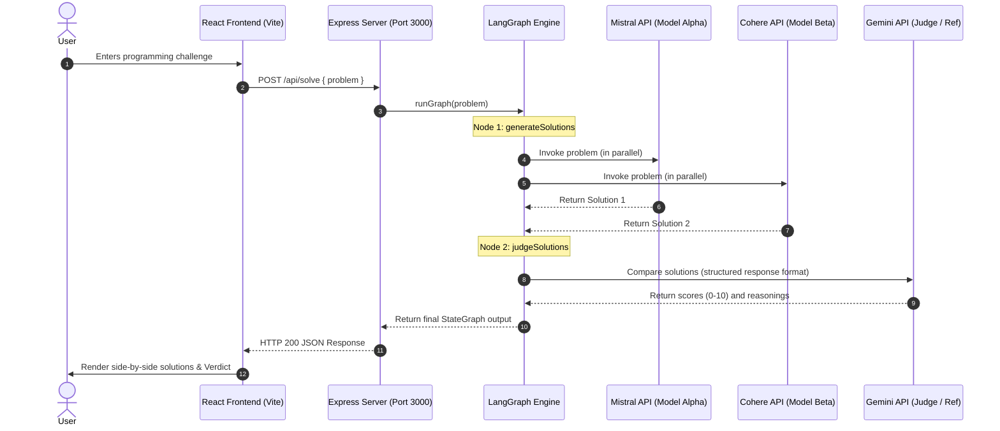

# ⚔️ AI Battle Arena


AI Battle Arena is an interactive, side-by-side LLM coding evaluation platform. It pits two powerhouses—**Mistral AI (Model Alpha)** and **Cohere (Model Beta)**—against each other in real-time coding duels, while utilizing **Google Gemini** as the expert judge to grade correctness, style, completeness, and clarity.

The application leverages a stateful multi-agent workflow powered by **LangGraph** in the TypeScript backend, and presents an ultra-premium, dark-themed responsive UI in the frontend built with **React 19**, **Tailwind CSS v4**, and custom component modules.

---

## 🖼️ User Interface & Artwork

The application features a modern Obsidian Dark theme (`#090909`) with a custom-generated high-fidelity 3D artwork.

### Custom 3D Illustration Asset
*   **Asset Path**: `Frontend/public/sidebar_illustration.png`
*   **Visual Content**: A detailed 3D digital illustration of two glowing neon brains (Indigo vs. Purple-Blue) clashing inside an obsidian cyber chamber.
*   **Aesthetic Usage**:
    *   **Sidebar Banner**: Displayed at the top of the sidebar with a dark fade gradient, scaling slightly on mouse-over.
    *   **Watermark**: Rendered as a subtle, low-opacity (`opacity-[0.15]`) background behind the project description at the bottom of the sidebar.

### Dashboard Interface Screenshot
*   **Asset Path**: `Frontend/public/image copy.png`
*   **Visual Content**: Full preview of the side-by-side solutions layout, styled HTML tables, list formatting, visual score bars, and modular interface panels.

---

## 🚀 Key Features

*   **Side-by-Side Dual Code Generation**: Prompts are executed in parallel by Mistral and Cohere, displayed in wide side-by-side columns.
*   **Structured AI Referencing**: Google Gemini acts as an expert judge, providing objective scores and reasoning.
*   **Collapsible Sidebar Console**: A toggle menu button in the header slides the sidebar drawer open/close (`w-0` to `w-[260px]`) to maximize workspace canvas.
*   **Visual Score Progress Bars**: Replaced plain badges with clean horizontal progress bars comparing solution scores.
*   **Custom Markdown Parser**: Features HTML table conversion (with borders and alternating row colors) and bullet/numbered lists formatting.
*   **Rate-Limit API Fallback**: If Gemini hits API rate limits, the backend catches the error and returns a fallback verdict page, ensuring code solutions are still displayed.
*   **Request Logger Middleware**: Logs HTTP requests, status codes, and server response times in the console.
*   **Lightweight Health Checks**: The frontend polls the server to show live connection lights without triggering heavy API calls.

---

## 📐 Architecture & Flow



---

## 📦 Project Structure & Modules

The application is structured cleanly, with logic separated into distinct modules.

### Frontend Modules (`Frontend/src/`)
*   **[App.jsx](file:///c:/Users/Tarun%20Tarun%20Rajput/Desktop/AIBettleArena/Frontend/src/app/App.jsx)**: Main orchestration component. It coordinates React state variables, localStorage persistence, backend connectivity checking, and renders sub-modules.
*   **[components/Sidebar.jsx](file:///c:/Users/Tarun%20Tarun%20Rajput/Desktop/AIBettleArena/Frontend/src/components/Sidebar.jsx)**: Renders the logo banner, clashing brains 3D image, active backend pulse connection indicators, battle history list, delete triggers, and the bottom faded illustration description card.
*   **[components/Header.jsx](file:///c:/Users/Tarun%20Tarun%20Rajput/Desktop/AIBettleArena/Frontend/src/components/Header.jsx)**: Houses the collapsible sidebar hamburger toggle, headers, and the backend online/offline status banner.
*   **[components/BattleArea.jsx](file:///c:/Users/Tarun%20Tarun%20Rajput/Desktop/AIBettleArena/Frontend/src/components/BattleArea.jsx)**: Manages empty states, suggestions cards, loading placeholders, user question blocks, side-by-side code solutions, and the full-width referee verdict block.
*   **[components/InputPanel.jsx](file:///c:/Users/Tarun%20Tarun%20Rajput/Desktop/AIBettleArena/Frontend/src/components/InputPanel.jsx)**: Renders the message input area, handling keypress triggers (Enter to send) and loading states.
*   **[components/Markdown.jsx](file:///c:/Users/Tarun%20Tarun%20Rajput/Desktop/AIBettleArena/Frontend/src/components/Markdown.jsx)**: Includes `CopyButton` with click feedback, HTML table parser, lists builder, and markdown-to-HTML formatting.

### Backend Modules (`Backend/src/`)
*   **`server.ts`**: Entry point that starts the Express server listening on port `3000`.
*   **`app.ts`**: Sets up JSON parsing, CORS, HTTP request logging middleware, and route handlers (`GET /` health checks, `POST /api/solve` solutions).
*   **`ai/graph.ai.ts`**: Declares the LangGraph engine, state schemas, and pipeline nodes. Implements a `try/catch` block around the judge node to return safe fallbacks on model rate limits.
*   **`ai/model.ai.ts`**: Initializes client connectors for Gemini (`gemini-flash-latest`), Mistral (`mistral-medium-latest`), and Cohere (`command-a-03-2025`).
*   **`config/config.ts`**: Validates and exports environment variable keys.

---

## 🔧 Installation & Setup

### Prerequisites
*   Node.js (v18 or higher)
*   API keys for Google Gemini, Mistral, and Cohere.

### 1. Backend Setup
Navigate to the `Backend` directory, install dependencies, and create a `.env` file:
```bash
cd Backend
npm install
```

Create a `.env` file inside the `Backend` directory:
```env
GOOGLE_API_KEY=your_gemini_api_key_here
MISTRAL_API_KEY=your_mistral_api_key_here
COHERE_API_KEY=your_cohere_api_key_here
```

Start the backend:
```bash
npm run dev
```
The server will run on `http://localhost:3000`.

### 2. Frontend Setup
Open a new terminal tab, navigate to the `Frontend` directory, and run the client:
```bash
cd Frontend
npm install
npm run dev
```
Open `http://localhost:5173` in your browser.

---

## 🔄 API Endpoint Reference

### `GET /`
*   **Description**: Lightweight health status endpoint used by the frontend to verify connectivity.
*   **Response**: `{"status": "ok"}` in <1ms.

### `POST /api/solve`
*   **Description**: Triggers a code battle for the user's input prompt.
*   **Payload**:
    ```json
    { "problem": "Write a fast Fibonacci function in Go" }
    ```
*   **Response**:
    ```json
    {
      "problem": "Write a fast Fibonacci function in Go",
      "solution_1": "... [Mistral code response] ...",
      "solution_2": "... [Cohere code response] ...",
      "judge": {
        "solution_1_score": 9,
        "solution_2_score": 8,
        "solution_1_reasoning": "Mistral provided a highly efficient iterative solution...",
        "solution_2_reasoning": "Cohere provided a simple recursive solution which is slower..."
      }
    }
    ```

---

## 🎨 Design System & Tokens

*   **Primary Background**: `#090909` (Obsidian Base)
*   **Secondary Background**: `#111111` (Sidebar panels)
*   **Card Surface**: `#171717` (Solutions/input backgrounds)
*   **Elevated Surface**: `#1F1F1F` (Headers, active items)
*   **Border & Divider**: `#27272A` (Obsidian borders)
*   **Fonts**:
    *   `Roboto`: Applied globally for clean UI typography.
    *   `JetBrains Mono`: Used for code snippets and formatting inside markdown blocks.
